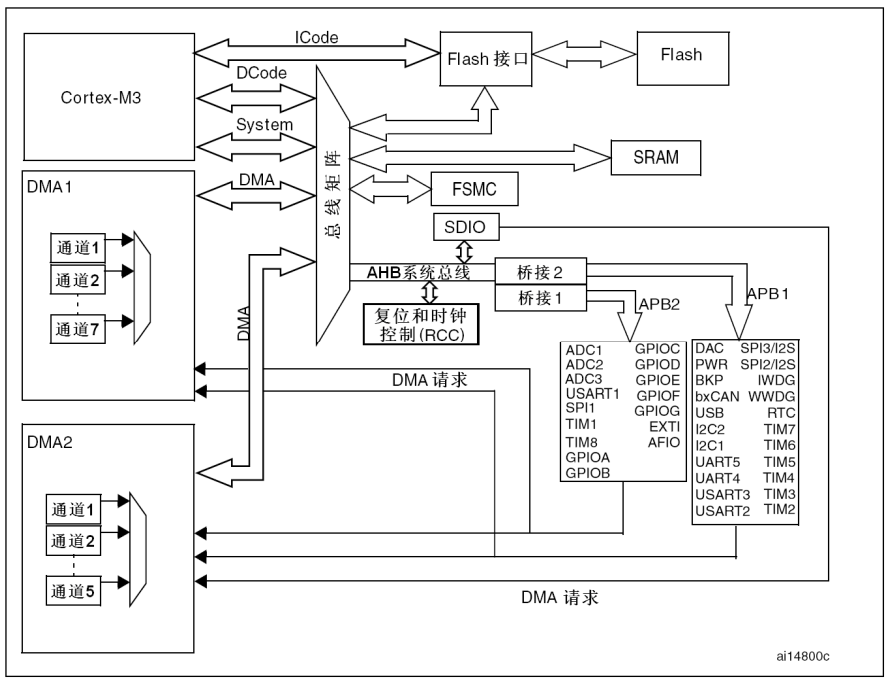

# Summary
    我们以STM32F103C8T6入手，整体理解SMT32芯片的框架以及基本外设  
## STM32F03C8T6
- 系列：主流系列STM32F1
- 内核：ARM Cortex-M3
- 主频：72MHz
- RAM：20K（SRAM）
- ROM：64K（Flash）
- 供电：2.0~3.6V（标准3.3V）
- 封装：LQFP48   
 
<!-- 这就是注释的表现形式 -->
<!-- 以下是一个段落的注释 -->
<!--
这是一个需要注释的段落。
它可能有很多行。
啊对对对，你说的都对
-->
<!-- 下面的操作手法难得，因为在github里面，居中就是一件天理不容的事情 -->
<!--

    

-->
---
## 片上资源/外设

---
## 命名规则

    

---
## 总线结构

---
## 型号分类及缩写

---
## 工程架构

    

